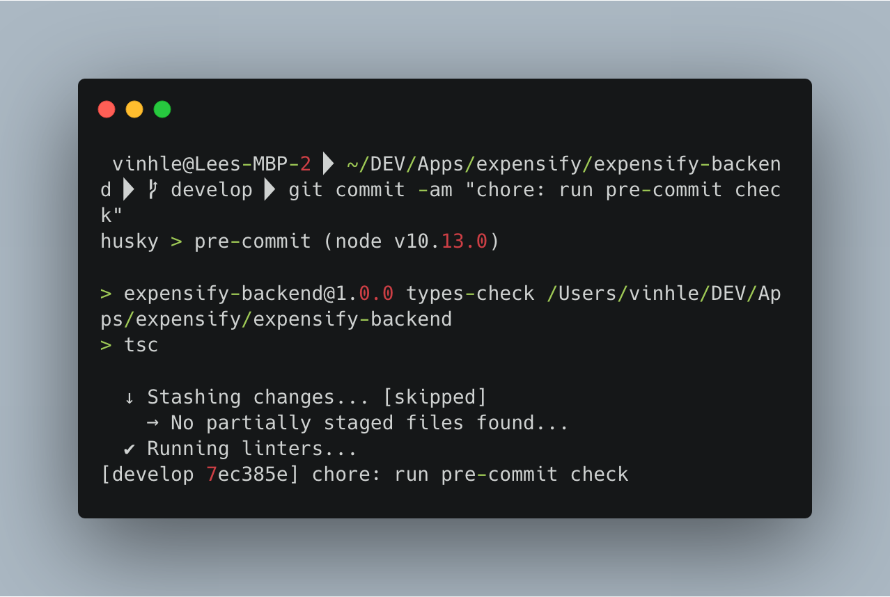
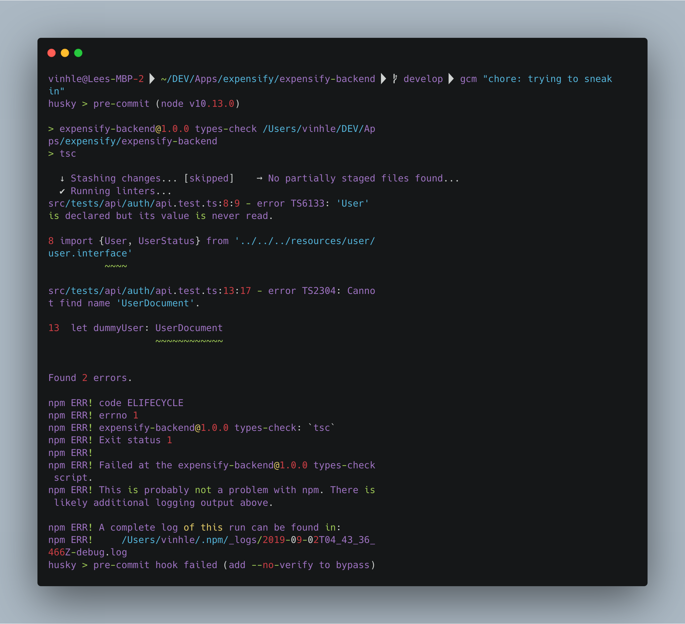

## Part 2: Running pre-commit checks with 🚫💩 Link-staged and 🐶 Husky"
In the [first-part](https://medium.com/shot-code/tooling-for-boosting-your-development-workflow-d663f7f5fd82) of this **Tooling** series, we got a hang out of why code formatting is important and how [Prettier](https://prettier.io/) makes it easier than ever. In this second part of the series, let's go through how to customise [Git Hooks](https://git-scm.com/book/en/v2/Customizing-Git-Git-Hooks) to run linting and formatting. Let's dive right in!

### Git Hooks and Pre-commit hook
In a nutshell, Git Hooks are custom actions that Git allows us to run at specific points of time. In **committing process**, the `pre-commit` hook runs first, before your changes are committed. This is a perfect time where we can check for linting and format our code. After that, all new committed changes will meet all linting rules and follow common coding style. This is ideal for our development workflow for 2 primary reasons:
* Our code is less error-prone as [linting](https://en.wikipedia.org/wiki/Lint_%28software%29) helps us to identify potential bugs from our common mistakes 🐛
* New feature and changes always follow our team's common coding styles. This [frees our mind from presentational difference](https://medium.com/shot-code/tooling-for-boosting-your-development-workflow-d663f7f5fd82) and allows us to focus on business logic.

Essentially, what we should do is to add `scripts` and tell Git to fires them in `pre-commit` hook. If new changes do not meet *linting or formatting rules*, **pre-commit check** will fail and changes will not be committed. However, in cases that we want to *bypass* this, such as adding an exceptional `console.log`, we can use `--no-verify`:
```bash
git commit -am "I need to workaround this time, nothing will break I promise" --no-verify
```

### Tools 🏎
We will use [🚫💩lint-staged](https://github.com/okonet/lint-staged) and [🐶Husky](https://github.com/typicode/husky) to make this happen:
* **Husky** allows us to specify which `script` to run in a Git hook.
* **Lint-staged** helps us to run particular commands for specific files based on their extensions. More importantly, these commands will be fired off on *staging files* only, not all files in the project. Thus, it is **fast** as you only want to lint/format files that are going to be committed.


### Coding time 👨🏻‍💻🔥
#### Step 1: Install dependencies
Let's first install `lint-staged` and `husky` as **dev-dependencies**
```bash
npm install --save-dev lint-staged husky
or
yarn add -D lint-staged husky
```
#### Step 2: Add script in pre-commit check
Let's configure `Husky` in `package.json` file:
```json
"husky": {
	"hooks": {
		"pre-commit": "lint-staged & npm run types-check"
	}
},
```
The command that we want to run has 2 parts. Let's add them in `package.json` as well:
```json
...
"scripts": {
	"lint": "tslint --project tsconfig.json",
	"types-check": "tsc",
	"format": "prettier \"**/*.+(js|json|ts|md|mdx|graphql)\" --write"
},
"lint-staged": {
	"src/*.ts": "npm run lint",
	"**/*.+(js|json|ts|md|mdx|graphql)": [
		"npm run format",
		"git add"
	]
},
...
```
What is happening? The first command that we specified in `pre-commit` hook is `lint-staged`. In here, we have 2 jobs to do:
* Specify extensions of *changed files* that we want to run the script.
 	* In this case, I want to check for linting with `.ts` files and format code among `js, json, ts, md, mdx, graphql` extensions.
* Write the actual script.
	* `npm run lint` will run script that we already had within `scripts` block. It checks for linting by `tslint`. If you do not use TypeScript, you probably want to run `eslint` here.
	* `npm run format` will format all changed files' code based on [Prettier rules](https://medium.com/shot-code/tooling-for-boosting-your-development-workflow-d663f7f5fd82).

This `pre-commit` check will success and use `git add` to add all changed files to staging and ready to be committed if there are no *linting errors*:



If something goes wrong, the check will fail and changes will not be allowed to commit, which is awesome:



### Key takeaways 🚀
* Bad codes suck. So don't let them sneak in your project at any moment.
* `🚫💩lint-staged` and `🐶husky` are great tools that help us to do such prevention. We configure them to run specific commands, most likely linting and code formatting.
* Combining with [Prettier](https://medium.com/shot-code/tooling-for-boosting-your-development-workflow-d663f7f5fd82), we have a perfect combo for our workflow 🏎
