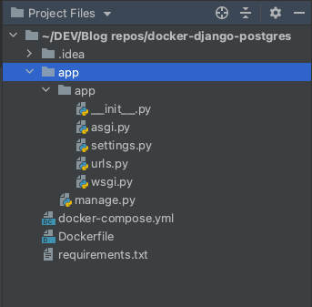
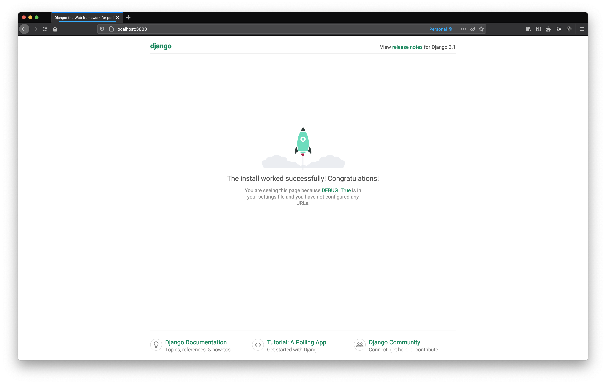
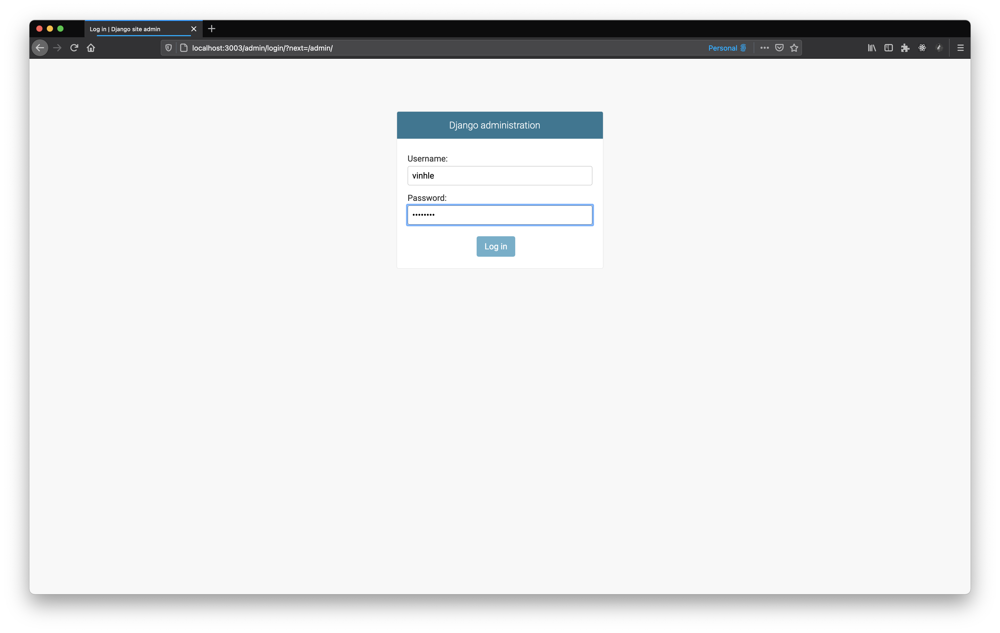
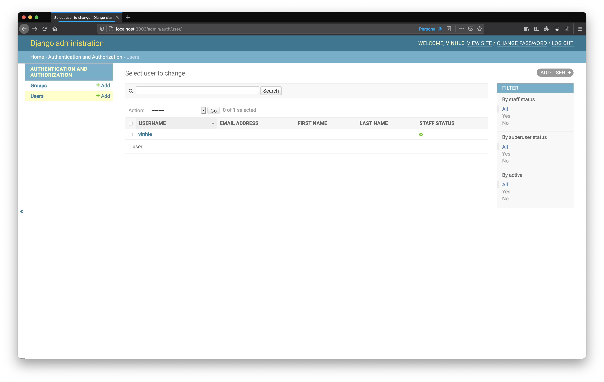

Photo by [frank mckenna](https://unsplash.com/@frankiefoto?utm_source=unsplash&amp;utm_medium=referral&amp;utm_content=creditCopyText) on [Unsplash](https://unsplash.com/s/photos/container?utm_source=unsplash&amp;utm_medium=referral&amp;utm_content=creditCopyText)

## From Node.js to Django
I have been picking up Python and Django for a while. In overall, Django seems to be pretty powerful with a loads of utilities.

Coming from Node.js world, I got so amazed by how Django helps to code much less and things just magically work out of the box.

Even though there has been a steep learning curve to get comfortable with a high level framework, I am more and more keen on its convenience and fast development speed.

## Project overview
In this blog, we will quickly bootstrap a simple Django API with PostgreSQL database. All services will run in Docker containers.

Our main goal is to:
* Use Docker to get the services up and running quickly without any hassle of configuring and debugging environment-related issues.
* Persist and access data in PostgreSQL container

## Prerequisites
Basic knowledge of:
* Django and Python
* PostgreSQL
* Docker and Docker compose

Besides, make sure that you have [Docker](https://docs.docker.com/get-started/) and [Postgres](https://www.robinwieruch.de/postgres-sql-macos-setup) up and running on your local machine. You could check if those 2 are running by:

```bash
docker --version
```

```bash
psql --version
```

## GitHub repo to follow
All the code in this blog could be found in [this repo](https://github.com/vinhlee95/django-pg-docker-tutorial).

It's coding time! 🥳 👨🏻‍💻

## Setup services
We will setup our services in following order:
- Setup Docker and Compose
- Create new Django project and configure database settings
- Setup PostgreSQL

### Setup Docker
**Setup Dockerfile**

In your project directory, create `requirements.txt` file. We will add all libraries that we need to install here. For now, there are only 2 needed: `Django` and `psycopg2`:

```text
Django>=3.1.2
psycopg2>=2.8.6,<2.8.7
```

🔖 [`Psycopg`](https://pypi.org/project/psycopg2/) is the most popular PostgreSQL adapter for Python.

Next, let's create a `Dockerfile` with following configurations:

```Dockerfile
FROM python:3.9-alpine

ENV PYTHONUNBUFFERED 1

COPY ./requirements.txt /requirements.txt

# Install postgres client
RUN apk add --update --no-cache postgresql-client

# Install individual dependencies
# so that we could avoid installing extra packages to the container
RUN apk add --update --no-cache --virtual .tmp-build-deps \
	gcc libc-dev linux-headers postgresql-dev
RUN pip install -r /requirements.txt

# Remove dependencies
RUN apk del .tmp-build-deps

RUN mkdir /app
WORKDIR /app
COPY ./app /app

# [Security] Limit the scope of user who run the docker image
RUN adduser -D user

USER user
```

**Setup docker-compose**

In the same directory, let's create a `docker-compose.yml` file:

```yaml
version: "3"

services:
  app:
    build:
      context: .
    ports:
      - "3003:3003"
    volumes:
      - ./app:/app
    command: >
      sh -c "python manage.py migrate && python manage.py runserver 0.0.0.0:3003"
```

🔖 In this Compose setup, we specify `3003` as server port and map the ports between the container and the host machine (our local machine).

Now we could use `docker-compose` command to create a new Django project:

```bash
docker-compose run --rm app django-admin startproject app
```

🔖  We could use `django-admin` here as it came with installed `Django`.

Django should create a new directory called `app` in our project:



Great job so far! Now let's build our image:

```bash
docker-compose build
```

You should get following output if the operation succeeded:
```bash
...
Successfully built 6c1e5849af55
Successfully tagged docker-django-postgres_app:latest
```

### Update Django database settings
Django came with `sqlite` as default database service. We want to use Postgres so let's change the `DATABASES` configurations in `app/app/settings.py`:

```python
import os

...

DATABASES = {
  'default': {
    'ENGINE': 'django.db.backends.postgresql',
    'HOST': os.environ.get('DB_HOST'),
    'NAME': os.environ.get('DB_NAME'),
    'USER': os.environ.get('DB_USER'),
    'PASSWORD': os.environ.get('DB_PASS'),
  }
}
```

We want to get Postgres configurations such as `HOST`, `NAME`, `USER`, `PASSWORD` from environment variables instead of hard coding them here.

### Setup PostgreSQL

Now we can add database env variables in `docker-compose.yml`:

```yaml
...
services:
  app:
    ...
    environment:
      - DB_HOST=db
      - DB_NAME=mydb-dev
      - DB_USER=vinhle
      - DB_PASS=password
    depends_on:
      - db
  db:
```

1 important thing to note from above's code is we just *create a new database service* called `db` and tell Docker to start `db` first every time we start the container since `app` *depends on* `db`.

Now we can continue adding configuration for our `db` service:

```yaml
services:
  ...
  db:
    image: postgres:13-alpine
    environment:
      - POSTGRES_DB=mydb-dev
      - POSTGRES_USER=vinhle
      - POSTGRES_PASSWORD=password
    ports:
      - "5432:5432"
```

Keep in mind that `POSTGRES_DB` could be anything of your choice.

**Create superuser**

Now we will use values from `POSTGRES_USER` and `POSTGRES_PASSWORD` variables to create a `superuser`:

```bash
docker-compose run --rm app python manage.py createsuperuser
```

🔖  If the command above fails to run, you might need to do an initial migration for the postgres database first:

```bash
docker-compose run --rm app python manage.py migrate
```

If the `createsuperuser` command runs, the terminal will ask you to enter `Username` and `Password` for the super user. Now you could enter those values from `POSTGRES_USER` and `POSTGRES_PASSWORD` in `docker-compse` file:

```bash
Creating docker-django-postgres_app_run ... done
Username (leave blank to use 'user'): vinhle
Email address:
Password:
Password (again):
This password is too common.
Bypass password validation and create user anyway? [y/N]: y
Superuser created successfully.
```

We will use this super user's credentials to access the database later.

## Get the server up and running
Now that we have all configurations correctly in place, let's start the server:

```bash
docker-compose up
```

Now open the browser and go to http://localhost:3003, you should see Django starter screen:



Let's go to Django Admin and try to login with the super user that we created in the previous step:



🛠 If you are unable to authenticate, you might want to re-create the super user role.

By selecting "User" tab in Django admin, you could see a list of users in our app:


## Database storage gotcha
So up until now, things have been running beautifully. We have both services: Django server and postgres running in their containers.

More interestingly, we have also created 1 super user and able to log in to Django admin with that credential.

Now let's try to "restart" both running containers by stopping them:

```bash
docker-compose down
```

and starting up again:
```bash
docker-compose up
```

Now both containers should up and running as we expected. Let's try to verify that things work as before by logging in to Django admin again by our old super user.

Can you authenticate that user?

If you have same Docker configuration that we have done so far, the answer is most likely NO. 🤦🏻‍♂️

Confusing? Yes I know. The bitter thing about Docker containers is that the data that they produced will be wiped out once the containers stopped. So our beloved super user is gone at the moment we type `docker-compose down`.

Thankfully, Docker provides useful tools to persist data generated and used by Docker containers. It is [recommended](https://docs.docker.com/storage/volumes/) to use `volumes` as they are managed by Docker (not by the OS host machines, aka our computers) and thus have better performance.

Let's add `volumes` for our `db` service in Compose file:

`docker-compose.yml`
```yaml
  db:
    ...
    volumes:
    - tutorial-volume:/var/lib/postgresql/data

volumes:
  tutorial-volume:
```

In the snippet above, we are "connecting" 2 sides of the colons `:`
* `tutorial-volume` is the name of the Docker volume that the data generated by the postgres container will sync to. This volume will be created and managed by Docker itself.
* `/var/lib/postgresql/data` is the location *inside the postgres container* where all the data get saved to.

Now let's start our containers up again:

```yaml
docker-compose up
```

In this invocation, the `tutorial-volume` is created by Docker. Any data generated by the postgres container will be persisted in that volume and it will be used next time the container is up.

Now if you try to create a new super user and restart the containers, you should be able to use the created user to login to Django admin.

Congratulations! You made it to the end of this blog 💯 To recap, here are what we have learnt:
* Dockerize Django server and PostgreSQL services using Docker Compose
* Persist data generated by Docker containers by Docker volumes

The source code could be found [here](https://docs.docker.com/storage/volumes/).