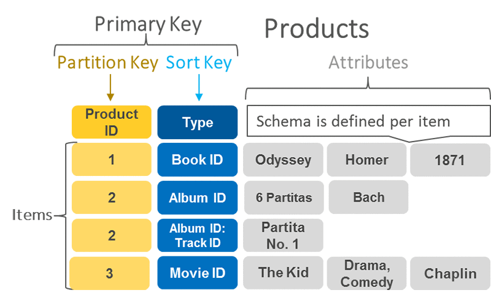

## What is DynamoDB?
In a nutshell, DynamoDB is:
* A No-SQL database service provided by Amazon Web Service
* Supports both [key-value](https://aws.amazon.com/nosql/key-value/) and [document databases](https://aws.amazon.com/nosql/document/)
* Predictable performance by the use of [Solid State Disk - SSD](https://en.wikipedia.org/wiki/Solid-state_drive)
* Multiregion: synchronously data in a DynamoDB table, originally from 1 region, to servers in multiple [Availability Zones](https://docs.aws.amazon.com/AWSEC2/latest/UserGuide/using-regions-availability-zones.html) (AZs)

## Consistency model
This starts from data replication support across different AZs. Each AZ connects to another in the same region via low-latency network and sync data.

Due to this nature, when an application tries to read data from a DynamoDB table, the response might not contain the most up-to-date data. The data will *eventually* be consistent across AZs.

DynamoDB support 2 types of *consistency model*
* **Eventually Consistent Read**: this model offers ultra-fast response speed. However, you might not get the freshest data up until a short-time-later retry.
* **Strongly Consistent Read**: database always return the most up-to-date data. Nonetheless, this comes with some costs such as higher latency, more resource-intensive as well as potential unavailability due to outages.

## Building blocks
### Tables
DynamoDB stores data in tables. Each table is a collection of data. In MongoDB - another No-SQL database, a table is a *collection*. Imagining we have a *User* table. We would expect to find any data related to all users in our app. What are inside user table? Well as you might expect, many different users. Each user is an *item* of the table.

### Items
Items are direct child components of Tables. Each item consists of *attributes* representing that item. An item in DynamoDB is like a *row* or *record* in SQL databases (MySQL, PostgreSQL) or a *document* in MongoDB.

### Attributes
An attribute is a primary data element that does not need to be broken down further. A *user item*, for instance, has *id*, *name*, *age*, *gender*...etc attributes.

Each item has a unique identifer, or a *primary key*, to differentiate itself from other items in the table. Our *user* items above could have *id* as primary key.

Most of the attribures have [*scalar*](https://stackoverflow.com/questions/6623130/scalar-vs-primitive-data-type-are-they-the-same-thing) type, which means each attribute is a single value. An attribute could be *nested* and contain deeper-level attributes. For example, *name* attribute could be an object that has `first_name (String)` and `last_name (String)`.

**Primary keys**

Primary key is a must-known topic of DynamoDB and a distinctive feature compared with other No-SQL alternatives.

Each *item* in a DynamoDB table has a unique *primary key*. There are 2 types of supported primary keys:
* **Partition key**: unique simple primary key that also involves in *where items are saved*. In a nutshell, when DynamoDB saves an item to disk, it hashes that item's partition key. Output of the hash function will determine which partition of the disk the item is going to be stored at.
* **Partition key and sort key**: partition key could be non-unique in this case but sort key. We could choose this primary key strategy to store same-partition items together. Let's look at an example:

(Source: [Choosing the Right DynamoDB Partition Key](https://aws.amazon.com/blogs/database/choosing-the-right-dynamodb-partition-key/))

We have 2 items with same partition key, which is `ProductId` having value of 2. However, their sort keys are different. 1 is `AlbumId` and another is `AlbumId:TrackId`. This make primary key combination of them different.

Do keep in mind that sharing a same partition key, however, is not always a good strategy. Frequent access of the same key in a partition can cause request throttling and overload database's provisioned throughput (capacity). Therefore, you should design your tables with the right partition key.

It is recommended to use *high-cardinality* attributes that have unique values for each item such as `user_id`, `product_id`...Besides, *composite* attributes could be a good choice to increase distinctiveness of the values. Take a look at above table example where we have a combination of `AlbumID` and `TrackID` to be sort key.

## Access control
In order to administer (create, delete) DynamoDB tables, you should have valid IAM credentials and permissions.

Security-wise, it is recommended to attach a service-specific permission to an user. In this case it could be `AmazonDynamoDBFullAccess`.

With this strategy, each IAM user in your organization only gets access to AWS services that user is allowed to control, instead of a God-mode `AdministratorAccess`. I will have a separate post on IAM roles in AWS.

## Read/Write capacity mode
When creating a new DynamoDB table, we need to configure its capacity to read and write data. This is quite app-specific and DynamoDB supports 2 capacity modes:
* **On-demand**: a tailored feature for *unpredictable* workloads and traffics. This mode offers pay-per-request pricing so you only pay for what you actually used.
* **Provisioned mode**: fit for applications that have *predictable* and *consistent* traffics. In this mode, you need to specify database throughput in *read capacity units* (RCUs) and *write capacity units* (WCUs).

How could you calculate RCUs and WCUs of your table? Here are factors that you should know in advance:
* How many *items* the table is expected to read/write *per second*
* Size of each item (KB)

Take an example when our table needs capacity to read 80 items per second. Each item has size of 3 KB.

**Calculating read capacity units (RCUs)**
> 1 RCU represents 1 *strongly consistent read* or 2 *eventually consistent read* per second, for an item up to 4 KB in size

So, if our table uses *eventually consistent read*, we would need: `Math.ceil(3/4) = 1` RCU. Therefore, we need to specify `1 x 80 = 80` RCUs for our table so that it could read 80 items per second.

With *strongly consistent read*, the number would be `80/2 = 40` RCUs.

**Calculating write capacity units (WCUs)**
> 1 WCU represent 1 *write per second* for an item up to 1 KB in size

So because each item's size is 3 KB, in order to write an item to the table, we need `3/1 = 3` WCUs.

## TL;DR
* DynamoDB is a predictable performance, No-SQL Amazon's database service.
* It supports key-value and document databases. It is also multiregional, which means your data is synchronised across multiple Availability Zones.
* DynamoDB supports 2 types of consistency model: *eventually consistent read* and *strongly consistent read*. The former offers high speed responses while the latter guarantees the most up-to-date data.
* *Tables, Items, Attributes* are core components of DynamoDB. Each item in a table must have unique *primary key*. It could be a distinct *partition key* alone or a combination of non-unique *partition key* and a unique *sort key*.
* In order to administer DynamoDB tables, an IAM user with valid permissions is required.
* *On-demand* and *Provisioned* are 2 *capacity mode* that we need to specify when creating a new table. *On-demand* mode is ideal for unpredictable workload applications. *Provisioned* mode requires us to specify the table's capacity in *read capacity units* and *write capacity units*.