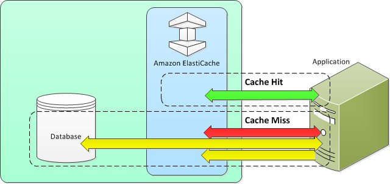

Photo by [Federica Galli](https://unsplash.com/@fedechanw?utm_source=unsplash&utm_medium=referral&utm_content=creditCopyText) on [Unsplash](https://unsplash.com/?utm_source=unsplash&utm_medium=referral&utm_content=creditCopyText)

## Caching
Caching is an essential element in a high-performance database. AWS provide a wide range of [caching solutions](https://aws.amazon.com/caching/aws-caching/) for its services and environments. For DynamoDB, [ElasticCache](https://aws.amazon.com/elasticache/) and [Amazon DynamoDB Accelerator (DAX)](https://aws.amazon.com/dynamodb/dax/) are most preferable choices.

Both services are in-memory cache in the cloud and designed to offload databases from heavy operations. Front-end clients therefore could retrieve the data faster and improve user experience.

Despite all these pros, we need to keep in mind that both ElasticCache and DAX are most sensible for READ-intensive applications where clients perform a large amount of GET requests over a period of time. In cases where data is processed in the background and do not need to be retrieved frequently like data warehousing or online transation applications, ElasticCache and DAX are most likely not a real deal.

Additionally, ElasticCache can be a layer between clients and various services such as Amazon RDS, S3, and even MongoDB. DAX, on the other hand, is specifically optimized for DynamoDB.

When server performs a query, it will hit DAX first. DAX then check if it has results of the query in cache. If yes then data will be returned immediately. Otherwise, it will send the query to the database. Here comes to the sweetest part: *data will be sync from DynamoDB to DAX*. And even greater, all of these synchronisation and management of DAX is provisioned and carried out by AWS.

## Caching strategies
There are 2 common types of caching strategies that you could adopt when using caching solutions like ElasticCache: Lazy loading  and Write-through. When to use what really depends upon the data and its access pattern. However, it is important to grasp their difference at first.

### Lazy loading
This strategy only load data to cache when necessary. It is pretty similar to the way DAX works above. Following diagram might illustrate better.

[Source: Caching Strategies - AWS](https://docs.aws.amazon.com/AmazonElastiCache/latest/mem-ug/Strategies.html)

There are 2 cases when server queries database:
* Cache Hit: when requested data is already stored in cache. ElasticCache will return the data instantly.
* Cache Miss: this happens with lazy loading in initial requests where the data has not been saved to cache. Query will be sent to database. After that, the server will then update the cache with results that database responded.

### Write-through
In this solution, application writes to cache right after it updates the database. This process is repeated in *every single request*.

### Pros and cons
Both strategies bring nice advantages along with trade-offs in certain aspects.

For speed and resources, lazy loading is a better way to archieve better performance since the application does not need to update cache every time. The cache also only save *meaningful* data that application actually needs and requests. Write-through, on the other hand, tries to update the cache everytime. This could certainly result in a longer process.

However, due to this frequent update, data in cache is never be stale. With lazy loading, cache is not in sync with database. Thus, it could returns to the application with outdated data.

There is a solution to keep data in cache not too stale by adding time to live to each write to the cache. After the key expires, the cache will treat it as not found and refresh expired key with a fresh value in the database. Keep in mind that there is still a race condition where returned data is still stale.

## Dynamo TTL - Time to live
Dynamo TTL is an *attribute* defines when items in a table will be deleted. To manage TTL, you will need to specify it in [Unix time](https://en.wikipedia.org/wiki/Unix_time) format for an attribute.

TTL is very useful to remove data that you no longer need such as user sessions, event logs and temporary data. Process is done automatically in the background and does not affect your table at the mean time.

## TL;DR
* Caching helps in improving performance for databases of READ-instensive applications.
* To implement caching in DynamoDB, we could use ElasticCache and DAX. ElasticCache could be front door for other database services while DAX is specifically designed for DynamoDB.
* There are 2 types of caching strategies: lazy loading and write-through. Lazy loading only loads to cache data that application asks for while write-through syncs cache with database in every request.
* Time to live (TTL) is an attribute in a DynamoDB table. It decides when to remove unnecessary data in the table. The process is done by DynamoDB in the backgroud.

## Resources
[Caching Strategies - Amazon ElastiCache](https://docs.aws.amazon.com/AmazonElastiCache/latest/mem-ug/Strategies.html)
[Caching Strategy with DynamoDB Streams, AWS Lambda and ElastiCache](https://medium.com/fernando-pereiro/caching-strategy-with-dynamodb-streams-aws-lambda-and-elasticache-2b309333cff9)
[Amazon DynamoDB Accelerator (DAX): A Read-Through/Write-Through Cache for DynamoDB | AWS Database Blog](https://aws.amazon.com/blogs/database/amazon-dynamodb-accelerator-dax-a-read-throughwrite-through-cache-for-dynamodb/)