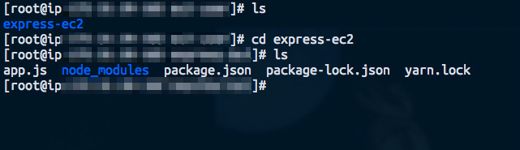
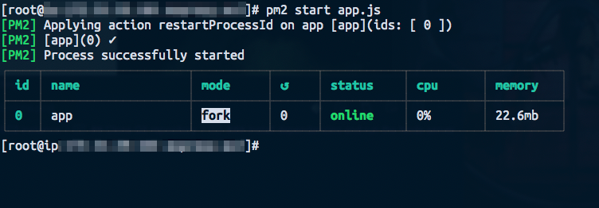
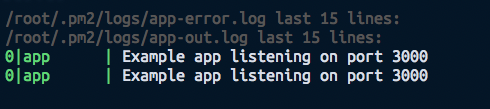
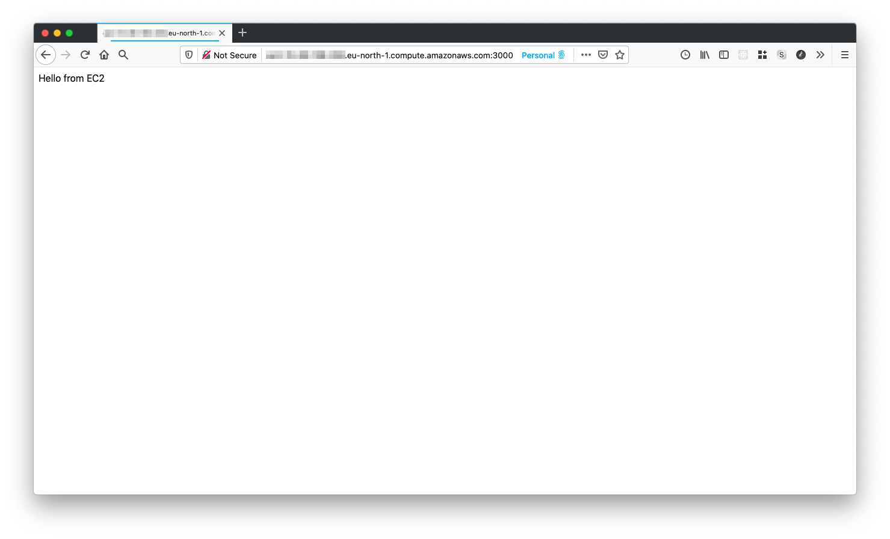

# Part 2: Run a NodeJS application on an EC2 instance


Photo by [Manuel Sardo](https://unsplash.com/@manuelsardo?utm_source=unsplash&amp;utm_medium=referral&amp;utm_content=creditCopyText) on [Unsplash](https://unsplash.com/s/photos/node?utm_source=unsplash&amp;utm_medium=referral&amp;utm_content=creditCopyText)

In the [previous part](https://blog.vinhlee.com/ec2/) of this blog, we have learnt to create and SSH to an EC2 instance. In this part, we will setup and run a NodeJS server on it 😎

Let's split the work into 3 smaller tasks. First of all, we need to configure our instance to accept traffics coming to Node server's port. Next, after installing `nvm` and `node`, we will clone the source code and get the server running.

## Edit Inbound Rules to accept traffic from server port
Let's add another security group for this purpose. This is pretending that our Node server will run on port 3000.

```yaml
MyInstance:
	...
	SecurityGroups:
		...
		- !Ref NodeServerGroup
	...
NodeServerGroup:
	Type: AWS::EC2::SecurityGroup
	Properties:
		GroupName: NodeServer
		GroupDescription: Allow traffics to instance in port 3000
		SecurityGroupIngress:
		- CidrIp: 0.0.0.0/0
			FromPort: 80
			IpProtocol: tcp
			ToPort: 3000
```

## Install `nvm` and `node` to the instance
First, we need to SSH to the instance:
```bash
ssh -i <pem-key-name.pem> ec2-user@<public_ip_v4>
```

If the instance asks you to run any updates, go ahead and do so:
```bash
sudo su
sudo yum update
```

Next, we need to install `nvm` in our instance:
```bash
curl -o- https://raw.githubusercontent.com/nvm-sh/nvm/v0.34.0/install.sh | bash
. ~/.nvm/nvm.sh
```

Let's verify if `nvm` has been successfully installed:
```bash
nvm --version
```

We could then install `node`:
```bash
nvm install node
...
node -v
```

## Clone Git repository
Let's make a Node Express app and push it to GitHub so that we could clone the source code to our instance. I have made a dead simple one that you might use as a reference: [vinhlee95/express-ec2](https://github.com/vinhlee95/express-ec2). Keep in mind that you will *have to* create your own repository to add SSH key generated in EC2 instance to your settings.

### Generate a SSH key in EC2 instance
We could do that by this command:

```bash
ssh-keygen
```
After following the instructions (remember to note down the passphrase), you should have a SSH key in place. Let's get it and add to GitHub settings:

```bash
cat ~/.ssh/id_rsa
```

Your newly generated SSH key will be shown in the Terminal. Copy it and and it in your GitHub SSH settings (Settings -> SSH and GPG keys -> New SSH key).

### Clone the source code

After having the SSH key saved, you should be able to clone your application's source code to EC2 instance:
```bash
git clone git@github.com:your-repo.git
```

After it is done, you should see application's code under your current directory:



### Install dependencies and run the Node server
Let's first install all of dependencies:
```bash
npm install
```

We will use [pm2](https://www.npmjs.com/package/pm2) - a Node process manager to start our server. Let's install it:
```bash
npm install -g pm2
...
pm2 -v
pm2 start app.js
```



Our server should be running now 🥂 Let's show server's logs in the terminal:
```bash
pm2 log
```


Cheers! Things are working now. Let's test it by open the instance's public DNS in the browser! You could get the URL in *Description* section in the bottom of AWS EC2's console. Remember that we need to specify our server's running port in the URL as well.



## Congrats! Your instance is running a Node.js server now 😎
Note that you might want to delete CloudFormation stack after done playing around to avoid any extra charge from AWS 😉

## Let's sum up what we have done to make it happen:

* Configure EC2's instance Inbound rules to accept traffic from server port.
* Install `nvm` and `node` in the instance
* Use Git to clone source code to the instance. In order to do that in the Linux instance, we need to:
	* Generate SSH key in the instance and add it to GitHub settings
	* Install Git and clone the repo
* Install app's dependencies along with PM2
* Run the Node.js server