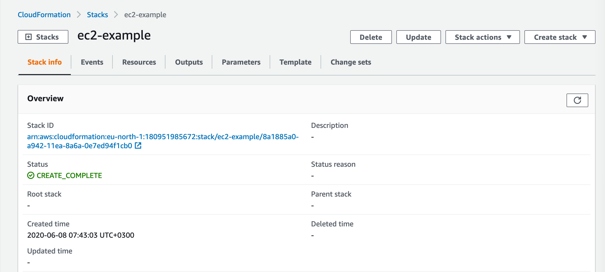
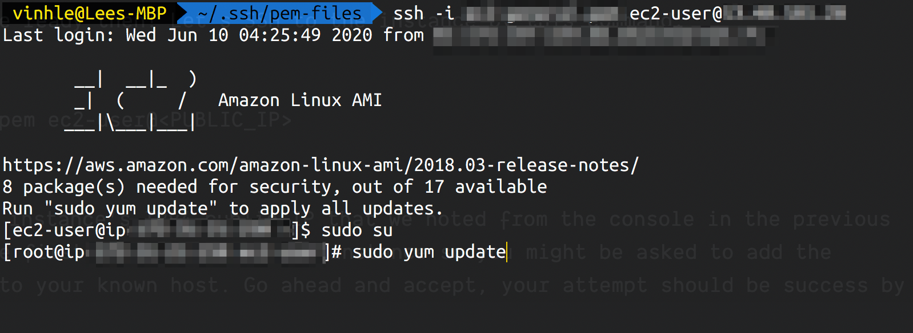

# Part 1: Create and SSH to an EC2 instance

## What is EC2
Elastic Compute Cloud (EC2) is an AWS's service providing compute capacity in the cloud. To make it simple, EC2 is the environment where your front-end, back-end,... applications live and run.

We are all aware that each application has different architectures and yours may run in a container one like Docker. However, at the end of the day, your Docker application will be run on an EC2 instance even if you might host your docker image in Elastic Container Repository (ECR) and use Elastic Container Service (ECS) to deploy and manage it.

Similarly, a static front-end React application, a server side NodeJS application could run on EC2 instances (S3 may be a better and simpler place for hosting static front-end apps). In AWS ecosystem, you will get to know more resources and services that *make it easier* deploying your application. However, EC2 is the popular final destination that those services deploy applications to.

### What is an EC2 instance?
An EC2 instance is a virtual server that could run an application program in Amazon's EC2 computing environment. You could create an EC2 instance via AWS console, CLI or templates. In this blog, I will show you how to do it via a CloudFormation template.

Ok, so there is no more cumbersome theory, let's see how EC2 look and work in action! 👨🏻‍💻😎

## Create an EC2 instance via CloudFormation template
### 📌 Prerequisite
* Have an AWS account
* Already installed AWS CLI in your local machine and add configuration for region, access key and secret key

You could refer to [AWS IAM blog](https://blog.vinhlee.com/iam/) for setup guide.

You could also check if the configuration has been done by checking in Terminal:
```bash
aws --version
aws-cli/2.0.11 Python/3.7.4
```

```bash
aws configure
AWS Access Key ID [your_configured_access_key]:
AWS Secret Access Key [your_configured_secret_key]:
Default region name [your_configured_region]:
Default output format [json]:
```
### Create CloudFormation template
CloudFormation is a declarative way to outline AWS infrastructure. Meaning you could define and configure resources in 1 template. AWS will take care of the rest (hard work) and create all of these defined services in the cloud.

The reason why I prefer CloudFormation instead of walking through step-by-step in AWS console GUI is because it is fairly straightforward. You could also easily pick up my template and we are sure to be on the same place 🥂

CloudFormation could be written in `yaml` or `json` formats. I am more keen on `yaml` due to its better readability.

In your project directory, create a file named `ec2.yaml`. We will add all of our EC2 instance's configuration here.

Add following configuration to your `yaml` file:
```yaml
Resources:
  MyInstance:
    Type: AWS::EC2::Instance
    Properties:
      AvailabilityZone: "eu-north-1a"
      ImageId: "ami-0c5254b956817b326"
      InstanceType: "t3.micro"
      KeyName: "ec2-general"
      SecurityGroups:
        - !Ref HTTPSecurityGroup
        - !Ref SSHSecurityGroup

  # Elastic IP for the instance
  MyEIP:
    Type: AWS::EC2::EIP
    Properties:
      InstanceId: !Ref MyInstance

  SSHSecurityGroup:
    Type: AWS::EC2::SecurityGroup
    Properties:
      GroupName: SSHSecurityGroupStack
      GroupDescription: Enable SSH access to instances via port 22
      SecurityGroupIngress:
      - CidrIp: 0.0.0.0/0
        FromPort: 22
        IpProtocol: tcp
        ToPort: 22

  HTTPSecurityGroup:
    Type: AWS::EC2::SecurityGroup
    Properties:
      GroupName: EC2CFHTTPGroup
      GroupDescription: Allow HTTP traffics to instance in port 80
      SecurityGroupIngress:
      - CidrIp: 0.0.0.0/0
        FromPort: 80
        IpProtocol: tcp
        ToPort: 80
```
You could find this template in this [gist](https://gist.github.com/vinhlee95/d125be62a3228cec8c60d5578287a050) as well.

The most important part that we need to focus in scope of this blog is our instance resource:
```yaml
MyInstance:
  Type: AWS::EC2::Instance
  Properties:
    AvailabilityZone: "eu-north-1a"
    ImageId: "ami-0c5254b956817b326"
    InstanceType: "t3.micro"
    KeyName: "ec2-general"
    SecurityGroups:
      - !Ref HTTPSecurityGroup
      - !Ref SSHSecurityGroup
```
In here we told AWS to create an EC2 instance in EU north 1a region (Stockholm). `ImageId` is id of an Amazon Image Machine (AMI) - our unit of deployment. Each API is an environment that packs up everything our application needs to run.

Our image id `ami-0c5254b956817b326` is configured by AWS to run on Linux platform. It has `t3.micro` instance type, which has quite limited resources (CPU, memory, network performance) but serves well for demo purpose (as for the name).

You could find out more about EC2's instance types [here](https://aws.amazon.com/ec2/instance-types/). If you want to use a different AMI, refer to [this guide](https://docs.aws.amazon.com/AWSEC2/latest/UserGuide/finding-an-ami.html).

### Upload CloudFormation template
Enter this command to your Terminal:
```bash
aws cloudformation create-stack --stack-name ec2-example --template-body file://ec2.yaml
```

The CLI will notify you if succeeded with a message containing new CloudFormation's stack id. To verify that, you'd need to [logging in to AWS's console](https://docs.aws.amazon.com/AWSCloudFormation/latest/UserGuide/cfn-console-login.html) and select the newly created stack:



### Create a key pair to access the instance
First, you need to go to EC2's console. Go to *Resources* tab of CloudFormation stack page, you should see an item on the list with `MyInstance` logical ID of type `AWS::EC2::Instance`. Click the link in its physical ID, you should be able to visit your EC2 console.

Next, select `Key Pairs` under `Network & Security` section in left side bar of the console. Click `Create key pair` and enter `ec2-general` as name. You should make sure that this name is *exactly similar* to `KeyName` in the CloudFormation template. Leave file format as `pem` as default and click create. The new key pair should be downloadable now 🥂

Another thing you need to note down from the console is the instance's public IPv4. Navigate to `Instances` section in the side bar and you could find it in the created instance's description.

### SSH to your instance
Now you should have the key pair downloaded in your local machine, we will use that as security gateway to connect to EC2 instance via SSH. In our CloudFormation template, we specify this as `SSHSecurityGroup` resource.

```yaml
SSHSecurityGroup:
  Type: AWS::EC2::SecurityGroup
  Properties:
    GroupName: SSHSecurityGroupStack
    GroupDescription: Enable SSH access to instances via port 22
    SecurityGroupIngress:
    - CidrIp: 0.0.0.0/0
      FromPort: 22
      IpProtocol: tcp
      ToPort: 22
```

Now let's open your Terminal and navigate to directory where the key pair is stored. The next thing to do is to use following command to set permissions of your file so that *only you can read it*. Otherwise, you will get [`Error: Unprotected private key file`](https://docs.aws.amazon.com/AWSEC2/latest/UserGuide/TroubleshootingInstancesConnecting.html#troubleshoot-unprotected-key)

```bash
chmod 400 my-key-pair.pem
```

Everything should be ready then! Let's SSH to the instance by this command:

```bash
ssh -i my-key-pair.pem ec2-user@<PUBLIC_IP>
```

`Public_IP` is your instance's IPv4 public IP that we noted from the console in the previous section. This is the first time we access the instance so you might be asked to add the instance's address to your known host. Go ahead and accept, your attempt should be success by now 🎉



Now you could switch to root user and update security patches for your instance:
```bash
sudo su
sudo yum update
```

## Congrats! You made it! 😎🎉 In this first part, we have learnt:
* Create an EC2 instance with security groups by CloudFormation template.
* Create a Key pair for accessing to the instance
* SSH to your instance

This also brings to the end of this part. In the upcoming part, we will get our hands dirtier running a NodeJS server in the instance. Stay tuned! 🙌