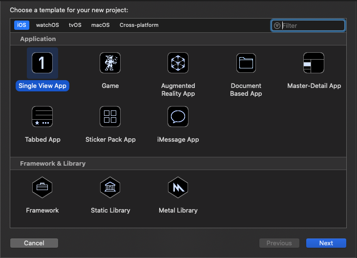
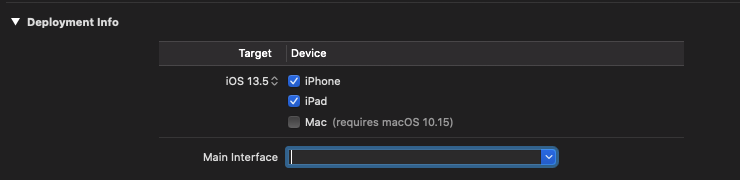

In this blog, I will try to briefly walk you though important steps to build an animating slide out menu, programmatically with Swift.

🔑 Key things to learn:
* Build UI in iOS programatically with Swift 5
* Auto layout
* Animation

## Setup
First, we need to create a new single view application in XCode


We want to build the UI programmatically. There are 2 things in our todo list for this:
* Create and delegate a custom view controller to be root one
* Remove all ties with Storyboard in the project

Let's create a new Swift file and name it `BaseViewController.swift` with minimal code setup:
```swift
import UIKit

class BaseViewController: UIViewController {
	override func viewDidLoad() {
		super.viewDidLoad()
		view.backgroundColor = .green
	}
}
```
Now in order to make this as root view controller to your app, we need to make changes in `scene` method in `SceneDelegate` class:
```swift
func scene(_ scene: UIScene, willConnectTo session: UISceneSession, options connectionOptions: UIScene.ConnectionOptions) {
	guard let scene = (scene as? UIWindowScene) else { return }
	window = UIWindow(windowScene: scene)
	window?.makeKeyAndVisible()
	window?.rootViewController = BaseViewController()
}
```
Next, remove `Main` from *Main interface* section in general project settings:


Build and run your app, you should see a view with entirely green background color. You made it after the first step! Now the app is starting with our custom view controller.

## Setup views
Our goal is to create this sort of menu:


So essentially, we need 2 views to make this happen:
* Home view: display our main content and slide out when we swipe it to the right side
* Menu view: hidden at first but sliding in as home view gets swiped

Let's setup those 2 views:

`BaseViewController.swift`
```swift
fileprivate let menuWidth: CGFloat = 300
fileprivate var homeViewLeadingConstraint: NSLayoutConstraint!
fileprivate var homeViewTrailingConstraint: NSLayoutConstraint!

override func viewDidLoad() {
	super.viewDidLoad()
	setupViews()
}
...
fileprivate func setupViews() {
	let homeView = UIView()
	let menuView = UIView()

	view.addSubview(homeView)
	homeView.anchor(top: view.topAnchor, leading: nil, bottom: view.bottomAnchor, trailing: nil)
	// Add leading constraint for home view, and store it in a variable
	// so that we could change it when animating the UI
	homeViewLeadingConstraint = homeView.leadingAnchor.constraint(equalTo: view.leadingAnchor)
	homeViewLeadingConstraint.isActive = true
	// Same thing for trailing constraint
	homeViewTrailingConstraint = homeView.trailingAnchor.constraint(equalTo: view.trailingAnchor)
	homeViewTrailingConstraint.isActive = true
	homeView.backgroundColor = .green

	view.addSubview(menuView)
	menuView.anchor(top: view.topAnchor, leading: nil, bottom: homeView.bottomAnchor, trailing: homeView.leadingAnchor)
	menuView.widthAnchor.constraint(equalToConstant: menuWidth).isActive = true
	menuView.backgroundColor = .orange
}
```

In this step, we just added 2 views in our base view: `homeView` and `menuView`. We also use Auto Layout to anchor those 2 like:
* `homeView` is anchored to fit to the whole view's screen *initially*. Looking closer, its `topAnchor` and `bottomAnchor` is constrained to corresponding anchors of the base view, *and they never change*.

We however, constrained its `leadingAnchor` and `trailingAnchor` explicitly. And *store those 2 constraints in variables*. The idea is to modify their `constant` value when animating the view.

* `menuView` is only anchored based on base view and `homeView`. We also added a `widthAnchor` for it.