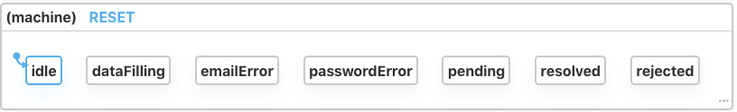
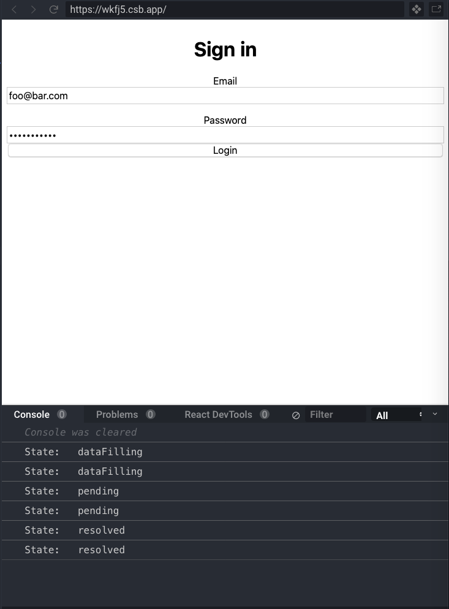

## Finite state machines
The concept of a Finite state machine is probably nothing new for all of us. It is even not a programming jargon. In fact, the behaviour of state machine can be easily observed *all around us*. Let's take a light bulb as an example.

The light has 2 *finite states*: on and off. And its state must be *either on or off*. It is impossible to have it on and off at the same time. When it is off and we want to turn it on and vice versa, we simply press the switch on the wall. Thinking about switching on and off as *inputs* to toggle the state of the light.

> A finite-state machine (Light bulb) is an abstract model that could only be in 1 state (on or off) at a time. The change from one state to another (Light 🌞 -> Dark ☽) is a *transition*. This transition happens in response to certain *inputs* (switch on or off 🎛)

You could read more about state machine's ideas and concepts in [XState documentation](https://xstate.js.org/docs/about/concepts.html#finite-state-machines) or [Wikipedia](https://en.wikipedia.org/wiki/Finite-state_machine)

## State machine in a Login form
Let's take these ideas and put it in a form. Imagine we are building a login form. Users will need to enter their email, password and click a Submit button to make an API request authenticating that credential with the server. As a matter of fact, we also need to verify that the email is valid, and the password must have at least 6 characters.

### Create form state machine
Our first task is to figure out which states the form could have. How do you think about this?

Got your answers yet? Do you have email, password, error in the state? If you have them then unfortunately, those are not quite the answer. Lemme give you a hint: our form could *only be in 1 state at a time*.

So, let's compare your second guess with mine now:

The form has `idle`, `dataFilling`, `emailError`, `passwordError`, `pending`, `resolved` and `rejected` state. Let's break these down:

* `idle`: state of the form when it is first mounted
* `idle` -> `dataFilling`: this transition happens when user start typing email and password
* `dataFilling` -> `emailError`: when email field is blurred and email is invalid. Reverse transition (`emailError` -> `dataFilling`) occurs when user modifies email.
* `dataFilling` -> `passwordError`: when password field is blurred and password is invalid. The reverse transition is similar to email.
* `dataFilling` -> `pending`: when user clicks Submit button and make an API request
* `pending` -> `resolved`: when user successfully authenticated
* `pending` -> `rejected`: when server rejects the authentication request

Let's put these ideas into code:

`machine.js`
```javascript
import { Machine, assign } from "xstate";

export const formMachine = Machine({
  initial: "idle",
  context: {
    email: "",
    password: ""
  },
  states: {
    idle: {},
    dataFilling: {},
    emailError: {},
    passwordError: {},
    pending: {},
    resolved: {},
    rejected: {}
  }
});

export const formOptions = {};
```

An awesome thing about XState is its [visualiser tool](https://xstate.js.org/viz). If we put `formMachine` constant into the visualiser, we could have an overal picture on our current form machine:



Though our machine at the moment is quite basic, it will be polished when we gradually add more transitions, events and actions.

### Connect form machine to React component
First we need to figure out which elements of our form machine need to be bound to UI component.

* **Context**: `email` and `password` are in form machine's context. We need to sync those two with corresponding text fields.
* **Events**: send `FIELD_CHANGE` and `FIELD_BLUR` events in text fields's `onChange` and `onBlur` event handlers.

Our initial React form component could simply be:

`App.js`
```javascript
export default function App() {
  const onChange = e => {
  };

  const onBlur = e => {
  };

  return (
    <form className="App" style={{ display: "flex", flexDirection: "column" }}>
      <label htmlFor="email">Email</label>
      <input
        id="email"
        type="email"
        name="email"
        onChange={onChange}
        onBlur={onBlur}
      />
      <label htmlFor="password" style={{ marginTop: 16 }}>
        Password{" "}
      </label>
      <input
        id="password"
        name="password"
        type="password"
        onChange={onChange}
        onBlur={onBlur}
      />
    </form>
  );
}
```

In order to implement form state machine in React component, we could use `useMachine` hook from XState:

`App.js`
```javascript
import { formMachine, formOptions } from "./machine";
export default function App() {
  const [state, send] = useMachine(formMachine, formOptions);
  // Now we could retrieve current's state via state.value and context via state.context
  // and send events via send method 🥂
  ...
}
```

Now let's retrieve email and password value and sync them with our text fields:
```javascript
export default function App() {
  ...
  const { email, password } = state.context;
  ...
  return (
    ...
    <input value={email} ... />
    <input value={password} ... />
    ...
  )
}
```

### Send text fields's events to form state machine
Next, we need to handle input events: `onChange` and `onBlur`:
```javascript
const onChange = e => {
  const { name, value } = e.target;
  send({
    type: "FIELD_CHANGE",
    field: name,
    value
  });
};

const onBlur = e => {
  send({
    type: "FIELD_BLUR",
    field: e.target.name
  });
};
```

With these handers, every time text fields fire `onChange` and `onBlur` events, we *send* events of types `FIELD_CHANGE` and `FIELD_BLUR` to our machine. Let's handle those two in `formMachine`:

`machine.js`
```javascript
export const formMachine = Machine({
  ...
  context: {
    email: "",
    password: ""
  },
  states: {
    idle: {
      on: {
        FIELD_CHANGE: {
          target: "dataFilling",
          actions: "changeField"
        }
      }
    },
    dataFilling: {
      on: {
        FIELD_CHANGE: {
          actions: "changeField"
        }
      }
    },
    ...
  }
});

export const formOptions = {
  actions: {
    changeField: assign((context, event) => ({
      [event.field]: event.value
    })
  }
}
```

To handle an event within state machine, we use `on` key in state object that the form is in. When the form is in `idle` state, our `FIELD_CHANGE` event will change the state to `dataFilling` and trigger `changeField` action.

The action is specified in `formOptions` for better readability. We could totally have it inline. In every XState action, we have access to `context` and `event` object. In this case, we use `field` and `value` from `FIELD_CHANGE` event to modify either `email` or `password` context accordingly.

Note that we need to handle `FIELD_CHANGE` event after the transition from `idle` to `dataFilling` happened. That's because an event and its actions will only be handled if we specify it in a particular state.

With this setup in place, you should see email and password field values get updated when typing in.

Now let's handle `FIELD_BLUR` event in the machine:
`machine.js`
```javascript
import { isEmail } from "validator";

export const formMachine = Machine({
  ...,
  dataFilling: {
    on: {
      ...,
      FIELD_BLUR: [
        { target: "emailError", cond: "isInvalidEmail" },
        { target: "passwordError", cond: "isInvalidPassword" }
      ]
    }
  },
  emailError: {
    on: {
      FIELD_CHANGE: {
        target: "dataFilling",
        actions: "changeField"
      }
    }
  },
  passwordError: {
    on: {
      FIELD_CHANGE: {
        target: "dataFilling",
        actions: "changeField"
      }
    }
  },
})


export const formOptions = {
  guards: {
    isInvalidEmail: (context, event) =>
      !isEmail(context.email) && event.field === "email",
    isInvalidPassword: (context, event) =>
      context.password.length < 6 && event.field === "password"
  },
  actions: {
    ...
  }
};
```

We could see `FIELD_BLUR` event will change the state from `dataFilling` to either `emailError` or `passwordError` depending on whether email or password is incorrect. These checks happen thanks to `isInvalidEmail` and `isInvalidPassword` *condition functions*, which are defined in `formOptions`.

Each [condition function](https://xstate.js.org/docs/guides/guards.html#guards-condition-functions) is a function taking `context` and `event` as two parameters and return either `true` or `false`. If email is invalid, we change the state to `emailError`. In this state, if user types on email field and thus send `FIELD_CHANGE` event to the machine, we move the state back to `dataFilling` and trigger `changeField` action at the same time.

Now that we have `emailError` and `passwordError` state in place, let's display error messages in the component:
`App.js`
```javascript
export default function App() {
  ...
  const hasEmailError = state.matches("emailError");
  const hasPasswordError = state.matches("passwordError");
  ...

  return (
    ...
    {hasEmailError && (
      <span style={styles.errorMessage}>Invalid email</span>
    )}
    ...
    {hasPasswordError && (
      <span style={styles.errorMessage}>
        Password must be at lest 6 character long
      </span>
    )}
  );
}
```

### Handle form submission event
We could send a `FORM_SUBMIT` event when submitting the form:
`App.js`
```javascript
...
const onSubmit = e => {
  e.preventDefault();
  send("FORM_SUBMIT");
};
...
```
And handle the event in form machine:
`machine.js`
```javascript
dataFilling: {
  on: {
    ...,
    FORM_SUBMIT: [
      { target: "emailError", cond: "isInvalidEmail" },
      { target: "passwordError", cond: "isInvalidPassword" },
      { target: "pending" }
    ]
  }
}
```

We first need to make sure user has entered valid credentials. Otherwise, we change the state to `emailError` and `passwordError`. State moved to `pending` only when both email and password are correct.

We need to update our guard conditions as well:
```javascript
guards: {
  isInvalidEmail: (context, event) => {
    if (event.field) {
      return !isEmail(context.email) && event.field === "email";
    } // This is to make sure we move the form to correct error state
    // (either email or password depending on which field got blurred)

    return !isEmail(context.email) // This is used in form submission
    // we want to make sure both fields are valid,
    // regardless of which got blurred;
  },
  // Same thing with password
  isInvalidPassword: (context, event) => {
    if (event.field) {
      return context.password.length < 6 && event.field === "password";
    }
    return context.password.length < 6;
  }
}
```

### Make an API request to authenticate user
Let's mock an login API request, pretending that our "server" will return a success response after 1 second:

`machine.js`
```javascript
const mockApiLogin = () => {
  return new Promise((resolved, rejected) => {
    setTimeout(() => resolved({ message: "Success" }), 1000);
  });
};
```

After `FORM_SUBMIT` event was sent to the machine with valid field values, the state will change from `dataFilling` to `pending`. Therefore, we need to make the API request in `pending` state:

`machine.js`
```javascript
export const formMachine = Machine({
  ...
  pending: {
    invoke: {
      src: "login",
      onDone: "resolved",
      onError: "rejected"
    }
  },
  resolved: {},
  rejected: {}
})

export const formOptions = {
  ...
  services: {
    login: (context, event) => mockApiLogin()
  }
}
...
```

If our API request succeeds, which we intentionally mocked it to be, we would expect the state to change from `pending` to `resolved`. Let's put a log in our component: `console.log("State: ", state.value);` and test the flow. You should see the result like:


Congrats! We just created an entire login flow with state machine. If you look at the UI component, all logics that the form contain are passed to form machine to handle. We only rely on which states the form is in to render specific components such as error messages. And making sure that we send the right events to the machine.

This UI component is thus resilient to logic changes, as we move from bottom-up logics handling to state machine. Tracking down bugs is also much easier since we know exactly where it could happen: our form state machine. If something goes wrong, we could first identify which state the form is in and checking if any events or actions are handled or dispatched incorrectly.

| No local component states, no more logics handled right from event handlers of UI components -> No bugs 🚫🐞

## TL;DR
* By using finite state machine, we assure that our models such as UI components could only be in 1 state at a time. In a particular state, we also explicitly handle certain types of events and trigger specific actions for each event.
* Using state machine calls for a shift in our mental models in handling state. There is no more bottom-up state handlers, where we update the state in event handler.
* To add a finite state machine to your model, you first need to definte states that the model could be in. Then for every events sent to the machine, we specify next state along with actions that we want the event to trigger.
* Since the state and all events, actions are handled in the machine, UI components are more resilient on logics changes.
* You could find all the codes in this [CodeSandbox project](https://codesandbox.io/s/funny-grothendieck-wkfj5).
